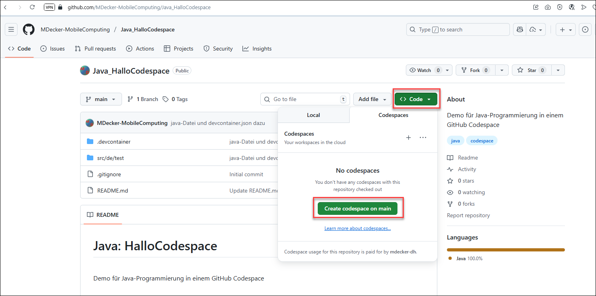
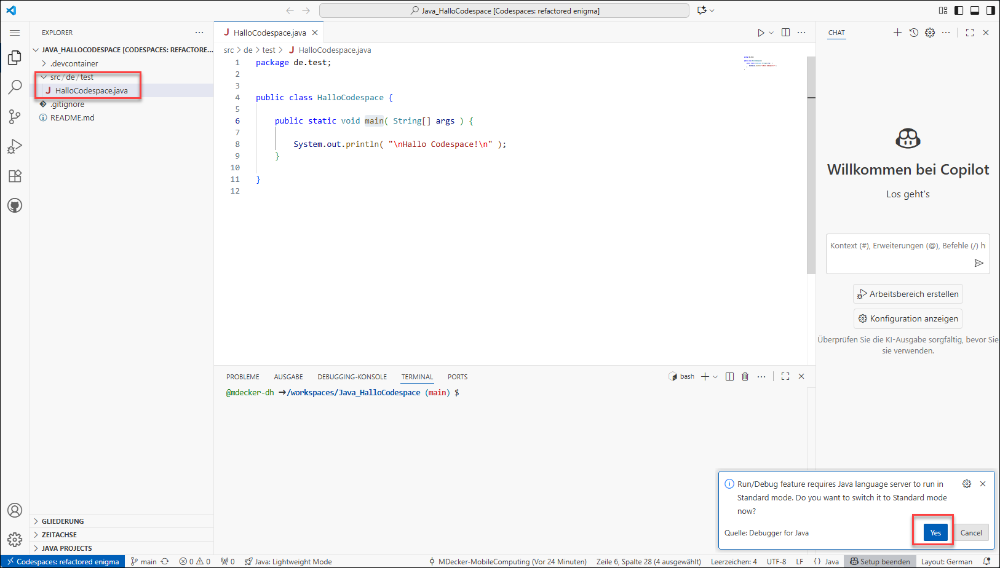
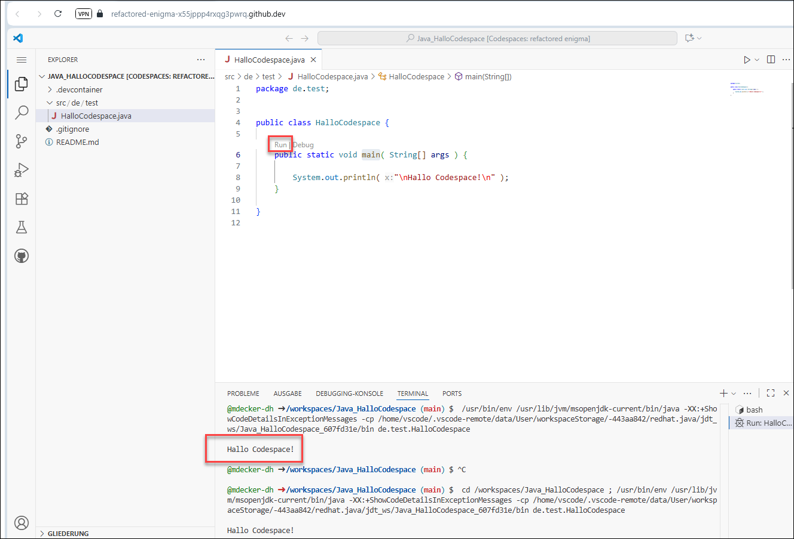
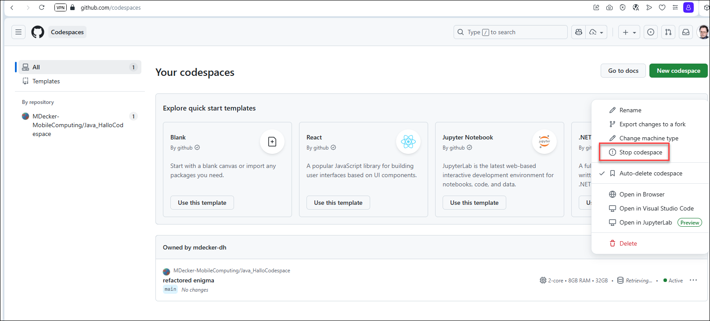
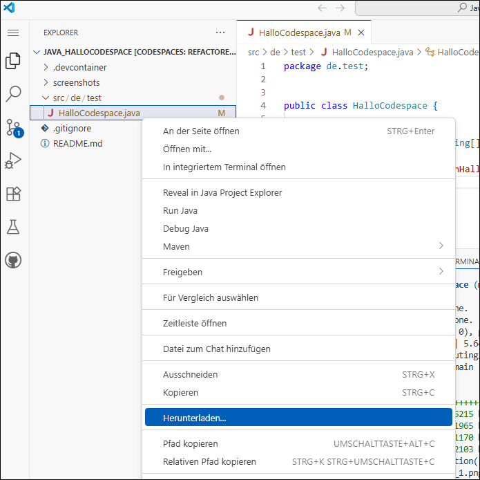
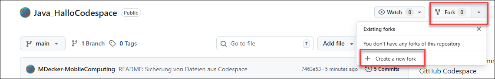

# Java: HalloCodespace #

<br>

Demo/Vorlage für Java-Programmierung in einem *GitHub Codespace* (Instanz von *Visual Studio Code*,
die im Web-Browser benutzt werden kann).

<br>

----

## Verwendung in Codespace ##

<br>

Dieses Repo in Codespace starten:



<br>

Sobald der Codespace gestartet ist, muss der "Java language server" auf "Standard mode" umgeschaltet werden:



<br>

Java-Klassen mit `main`-Methode können über den "Run"-Link gestartet werden, die Ausgabe erscheint unten im "Terminal"-Fenster.



<br>

Unter https://github.com/codespaces können Sie den Codespace stoppen, damit der "Gebührenzähler" nicht weiter läuft:



Auf dieser Seite können Sie auch den Codespace wieder starten.

<br>

----

## Sicherung der Dateien ##

<br>

Standardmäßig werden inaktive Codespace-Instanzen nach 30 Tagen gelöscht, damit gehen auch alle Datei-Änderungen (z.B. neue Java-Dateien) verloren.

Einzelnen Dateien können im Explorer rechts durch den Kontextmenü-Eintrag "Herunterladen ..." auf den lokalen Rechner heruntergeladen werden:

<br>



<br>

Sie können auch den folgenden Befehl im "Terminal"-Fenster unten auszuführen, um alle Java-Dateien
im Workspace in eine ZIP-Datei im Wurzelverzeichnis des Code-Space zu erzeugen, die dann auch mit
dem Kontextmenü-Eintrag "Herunterladen ..." auf den lokalen Rechner heruntergeladen werden können:

```
zip -r codespace-export.zip . -i '*.java'
```

<br>

Alternativ können Sie das Repo auf "forken", also eine Kopie davon in Ihrem eigenen GitHub-Account anlegen,
so dass geänderte Dateien nach einem Commit darin
gepusht werden können.

<br>



<br>

----

## Kostenloses Nutzungskontingent ##

<br>

Mit einem kostenlosen GitHub-Account sind 120 Kernstunden/Monat an Codespace-Nutzung enthalten (Achtung: der Codespace hat mindestens 2 CPU-Kerne, pro Stunde Laufzeit werden also zwei Kernstunden verbraucht); bei einem Pro-Account (z.B. kostenloser Studenten-Account) sind es 180 Kernstunden/Monat. ([Quelle](https://docs.github.com/de/billing/concepts/product-billing/github-codespaces#free-quota))

<br>